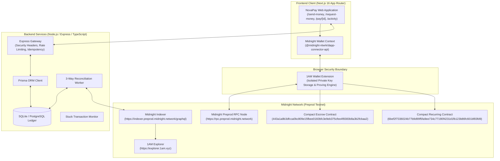

# 📖 NovaPay Complete Protocol Documentation

> **Decentralized Zero-Knowledge Remittance Protocol on Midnight Network (Preprod)**  
> Comprehensive Technical Specifications, Architecture, Smart Contracts, APIs, and Development Guide.

---

## 📑 Table of Contents

1. [System Overview & Value Proposition](#1-system-overview--value-proposition)
2. [High-Level Architecture](#2-high-level-architecture)
3. [Midnight Preprod Smart Contracts](#3-midnight-preprod-smart-contracts)
4. [End-to-End Protocol Flows](#4-end-to-end-protocol-flows)
5. [Complete REST API Reference](#5-complete-rest-api-reference)
6. [Data Models & Schema Reference](#6-data-models--schema-reference)
7. [Local Development & Deployment Guide](#7-local-development--deployment-guide)
8. [Automated Testing & Verification Matrix](#8-automated-testing--verification-matrix)

---

## 1. System Overview & Value Proposition

**NovaPay** is an enterprise-grade, privacy-preserving decentralized finance protocol built on the **Midnight Blockchain (Preprod Testnet)**. It provides frictionless cross-border remittances, peer-to-peer invoicing, conditional zero-knowledge escrow agreements, and pre-authorized recurring subscriptions without exposing commercial payment metadata or wallet balances on public ledgers.

### Core Problems Addressed
* **Excessive Intermediary Wire Fees**: Traditional correspondent banking rails impose 3%–7% in foreign exchange and transfer commissions. NovaPay uses native `tDUST` on Midnight Preprod with negligible transaction costs.
* **Settlement Latency**: SWIFT and traditional wire transfers take 3 to 5 business days. NovaPay settles transactions on-chain with instant block confirmation.
* **Public Ledger Privacy Leakage**: Public L1 blockchains expose full wallet transaction histories, counterparties, and cash flow to the entire world. NovaPay uses **Midnight Compact Zero-Knowledge circuits** to ensure transaction metadata remains completely private.
* **Centralized Custodial Risk**: Centralized processors (Stripe, PayPal) retain full custody of funds and can freeze balances unilaterally. NovaPay guarantees that only the user's private key via **1AM Wallet** can authorize fund movements.

---

## 2. High-Level Architecture

NovaPay combines a modern Next.js 16 client, an isolated browser extension wallet connector, a secure Express backend ledger, and on-chain Compact ZK contracts:



---

## 3. Midnight Preprod Smart Contracts

NovaPay features two production-compiled Compact Zero-Knowledge smart contracts deployed and verified on Midnight Preprod:

### Contract 1: ZK Escrow Agreement Contract
* **Contract Identifier**: `443a1a8b3dfcca0bc809e15fbee0160bfc3e9eb375cfee4f8383b8a3b2fcbaa2`
* **Source Path**: `contracts/escrow.compact`
* **Client Binding**: `src/contracts/escrow/client.ts`
* **Service Layer**: `src/contracts/escrow/service.ts`
* **Core Functions**:
  * `deposit(amount, recipient, arbiter)`: Commits `tDUST` to an on-chain vault with private counterparties.
  * `release(agreementId)`: Triggered by payer or authorized arbiter upon fulfillment of commercial terms.
  * `refund(agreementId)`: Releases locked funds back to depositor if timeout conditions are met.

### Contract 2: Pre-Authorized Recurring Billing Contract
* **Contract Identifier**: `6bef2f7336024b77b9d99f5fa9ee734c77190f4231d1fb123b86fc601bf83fd9`
* **Source Path**: `contracts/recurring.compact`
* **Client Binding**: `src/contracts/recurring/client.ts`
* **Service Layer**: `src/contracts/recurring/service.ts`
* **Core Functions**:
  * `authorizeSubscription(merchant, maxAmountPerPeriod, periodDuration)`: Pre-authorizes recurring pulls under strict cryptographic spending ceilings.
  * `executePayment(subscriptionId)`: Merchant triggers settlement after period expiration without storing customer card details.
  * `cancelSubscription(subscriptionId)`: Immediately revokes merchant authorization on-chain.

---

## 4. End-to-End Protocol Flows

### Flow 1: P2P Remittance Settlement
1. **User Initiation**: Sender inputs recipient's Bech32m address (`mn_addr_preprod1...`) and transfer amount.
2. **Payload Formulation**: `MidnightWalletContext` validates address format using Bech32 checksum rules and packages the native transfer payload.
3. **Wallet Interaction**: 1AM Wallet generates the zero-knowledge transaction proof locally and requests user biometric/PIN authorization.
4. **Broadcast & Hash Extraction**: 1AM submits transaction to Midnight Preprod RPC. NovaPay intercepts the canonical 64-character hex transaction identifier (`8d9b443a...`), discarding non-finalized CBOR metadata.
5. **Backend State Tracking**: Express API logs transaction as `PENDING`. Background worker queries the Midnight Indexer until block confirmation converts status to `SUCCESS`.

### Flow 2: Zero-Knowledge Invoicing & One-Click Payment Links
1. **Invoice Creation**: Merchant issues invoice via `/request-money` specifying amount, currency denomination, and due date.
2. **Payment Link Generation**: A permalink (`/pay/[id]`) is generated with embedded metadata and QR code representation.
3. **Payer Settlement**: Counterparty opens link, connects 1AM Wallet, and signs one-click transaction.
4. **Reconciliation**: NovaPay records transaction hash, updates invoice status to `PAID`, and triggers real-time push notification to merchant.

---

## 5. Complete REST API Reference

The backend API server operates on port `5001` (or deployed at `https://novapay-w4zv.onrender.com`).

### 1. Authentication (`/api/auth`)
* `POST /api/auth/challenge`: Generates a cryptographic nonce for wallet authentication.
* `POST /api/auth/verify`: Verifies wallet signature and issues a scoped JWT session token.

### 2. Remittances & Send Money (`/api/send-money`)
* `POST /api/send-money/submit-transaction`: Logs initial transfer payload and sets status to `PENDING`.
  ```json
  {
    "senderWallet": "mn_addr_preprod1...",
    "recipientWallet": "mn_addr_preprod1...",
    "amount": "150.00",
    "txHash": "8d9b443a...64chars"
  }
  ```
* `POST /api/send-money/confirm-transaction`: Updates transaction to `SUCCESS` after on-chain indexer confirmation.
* `GET /api/send-money/history?walletAddress=<addr>`: Retrieves paginated transfer history.

### 3. Invoices & Payment Requests (`/api/payment-requests`)
* `POST /api/payment-requests`: Creates a new payment request.
* `GET /api/payment-requests?walletAddress=<addr>`: Returns incoming and outgoing requests.
* `PATCH /api/payment-requests/:id/pay`: Marks request as settled with canonical `txHash`.
* `PATCH /api/payment-requests/:id/decline`: Cancels or declines a pending payment request.

### 4. Escrow Agreements (`/api/escrow`)
* `POST /api/escrow/create`: Registers an on-chain escrow agreement ID.
* `GET /api/escrow/:id`: Fetches agreement status, arbiter info, and fund release state.
* `POST /api/escrow/:id/release`: Records release transaction receipt.

### 5. Recurring Subscriptions (`/api/recurring`)
* `POST /api/recurring/subscriptions`: Logs authorized recurring billing agreement.
* `GET /api/recurring/subscriptions?walletAddress=<addr>`: Lists active subscriptions.
* `POST /api/recurring/subscriptions/:id/charge`: Executes scheduled cycle charge.

---

## 6. Data Models & Schema Reference

NovaPay uses Prisma ORM with SQLite for local execution and PostgreSQL for production deployments (`server/prisma/schema.prisma`):

| Model | Key Fields | Description |
| :--- | :--- | :--- |
| **User** | `id`, `walletAddress`, `email`, `kycLevel`, `riskScore` | Profile and compliance tier records |
| **Transaction** | `id`, `txHash`, `senderWallet`, `recipientWallet`, `amount`, `status` | Core remittance settlement ledger |
| **PaymentRequest** | `id`, `creatorWallet`, `recipientWallet`, `amount`, `status`, `expiresAt` | Invoice state machine tracking |
| **EscrowAgreement** | `id`, `contractAddress`, `depositor`, `beneficiary`, `arbiter`, `status` | ZK Escrow contractual state |
| **Subscription** | `id`, `merchantWallet`, `subscriberWallet`, `amount`, `frequency`, `status` | Recurring billing limits & history |
| **Notification** | `id`, `recipientWallet`, `title`, `message`, `isRead` | Real-time notification queue |

---

## 7. Local Development & Deployment Guide

### Prerequisites
* Node.js v18.0.0 or higher
* npm or pnpm
* 1AM Wallet Extension installed in Chrome/Brave (configured for Midnight Preprod)

### Setup Steps
```bash
# 1. Clone repository
git clone https://github.com/Riju79/NovaPay.git
cd novapay

# 2. Install dependencies
npm install
cd server && npm install && cd ..

# 3. Configure environment
cp .env.example .env.local
cp server/.env.example server/.env

# 4. Initialize Database
cd server
npx prisma generate
npx prisma migrate dev --name init
cd ..

# 5. Start Full-Stack Development
# Terminal 1: Backend API (Port 5001)
cd server && npm run dev

# Terminal 2: Frontend App (Port 3000)
npm run dev
```

---

## 8. Automated Testing & Verification Matrix

NovaPay includes 16 discrete automated test suites in `server/test/`:

```bash
cd server
npm test
```

| Test Suite | File | Focus Area | Status |
| :--- | :--- | :--- | :---: |
| **Security Hardening** | `security-hardening.test.js` | CSP, HSTS, Rate Limiter, Zero Secret Leakage, Idempotency | ✅ Passed |
| **Preprod Deployment** | `preprod-deployment.test.js` | Preprod RPC connectivity, Indexer GraphQL, Contract IDs | ✅ Passed |
| **E2E Settlement** | `end-to-end-settlement.test.js` | 3-Way Reconciliation, Status Transitions, Remittance State | ✅ Passed |
| **Smart Contracts** | `contracts.test.js` | Escrow deposit/release logic, Recurring spending limits | ✅ Passed |
| **Blockchain Service** | `blockchain.test.js` | Canonical 64-char hash parsing, DApp connector integration | ✅ Passed |
| **Compliance & Limits** | `compliance.test.js` | Tiered risk scoring, sanction lists, daily velocity controls | ✅ Passed |
| **Observability** | `observability.test.js` | Structured logging, correlation tracking, stuck tx detection | ✅ Passed |
