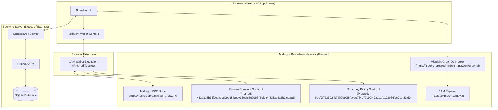

<p align="center">
  <a href="https://midnight.network"></a>
  <a href="https://midnight.network"></a>
  <a href="https://nextjs.org"></a>
  <br/>
  <a href="https://midnight.network"></a>
  <a href="https://explorer.1am.xyz"></a>
  <a href="https://x.com/nilendu_?s=11"></a>
  <a href="https://youtu.be/9cOaJHHv664?si=IWxBJ0XOHOv9-C6v"></a>
  <br/>
  <a href="https://forms.gle/rqRkSQ8GxV4umwzYA"></a>
  <a href="https://docs.google.com/spreadsheets/d/1_IyUaHtmlc3sxifecwlS66TqO4k2fY25ubGdxF9DmEo/edit?usp=sharing"></a>
  <a href="https://github.com/Riju79/NovaPay"></a>
  <a href="LICENSE"></a>
</p>

```text
███╗   ██╗██████╗ ██╗   ██╗█████╗ ██████╗ █████╗ ██╗   ██╗
████╗  ██║██╔══██╗██║   ██║██╔══██╗██╔══██╗██╔══██╗╚██╗ ██╔╝
██╔██╗ ██║██║  ██║██║   ██║███████║██████╔╝███████║ ╚████╔╝ 
██║╚██╗██║██║  ██║╚██╗ ██╔╝██╔══██║██╔═══╝ ██╔══██║  ╚██╔╝  
██║ ╚████║╚██████╔╝ ╚████╔╝ ██║  ██║██║     ██║  ██║   ██║   
╚═╝  ╚═══╝ ╚═════╝   ╚═══╝  ╚═╝  ╚═╝╚═╝     ╚═╝  ╚═╝   ╚═╝   
```

<h3 align="center">💸 Decentralized Zero-Knowledge Remittance Protocol on Midnight Network (Preprod)</h3>

<p align="center">
  <b>Send P2P Remittances · Create Invoices · ZK Escrow Agreements · Pre-Authorized Recurring Billing · Live on Midnight Preprod</b>
</p>

<p align="center">
  <a href="https://novapay-steel.vercel.app">🌐 Live App</a> ·
  <a href="https://youtu.be/9cOaJHHv664?si=IWxBJ0XOHOv9-C6v">🎬 Demo Video</a> ·
  <a href="https://x.com/nilendu_?s=11">🐦 Twitter / X</a> ·
  <a href="https://forms.gle/rqRkSQ8GxV4umwzYA">📝 Feedback Form</a> ·
  <a href="https://docs.google.com/spreadsheets/d/1_IyUaHtmlc3sxifecwlS66TqO4k2fY25ubGdxF9DmEo/edit?usp=sharing">📊 Survey Spreadsheet</a> ·
  <a href="#-what-is-novapay">📚 Documentation</a> ·
  <a href="https://github.com/Riju79/NovaPay">🐙 GitHub Repo</a> ·
  <a href="https://explorer.1am.xyz">🔍 1AM Explorer</a> ·
  <a href="https://novapay-w4zv.onrender.com">⚙️ Backend API</a>
</p>

---

## 📝 Implementation Feedback & User Testing

We are actively gathering structured user testing feedback and survey responses for NovaPay on the Midnight Preprod Network. Community members, developers, and testers can review our public test data or submit evaluations directly:

| Resource | Direct Link | Description |
| :--- | :--- | :--- |
| **Implementation Feedback Form** | [📝 Submit Feedback (Google Forms)](https://forms.gle/rqRkSQ8GxV4umwzYA) | Submit user testing reviews, feature requests, and UX evaluations |
| **Public Survey Responses** | [📊 View Responses Sheet (Google Sheets)](https://docs.google.com/spreadsheets/d/1_IyUaHtmlc3sxifecwlS66TqO4k2fY25ubGdxF9DmEo/edit?usp=sharing) | Live public spreadsheet tracking 82+ community testing records |
| **Official NovaPay Twitter / X** | [🐦 @nilendu_ on X](https://x.com/nilendu_?s=11) | Official announcements, protocol updates, and developer contact |

> [!TIP]
> **Have you tested NovaPay on Midnight Preprod?**  
> We value your feedback! Please take 60 seconds to fill out the [Implementation Feedback Form](https://forms.gle/rqRkSQ8GxV4umwzYA). All verified tester responses are transparently tracked in our [Public Community Spreadsheet](https://docs.google.com/spreadsheets/d/1_IyUaHtmlc3sxifecwlS66TqO4k2fY25ubGdxF9DmEo/edit?usp=sharing).

---

## ✨ What Is NovaPay?

**NovaPay** is a high-fidelity, privacy-preserving decentralized finance platform designed for global cross-border remittances, P2P invoicing, conditional escrow agreements, and pre-authorized recurring merchant billing.

By leveraging the **Midnight Blockchain** and **Compact Zero-Knowledge (ZK) Circuits**, NovaPay eliminates traditional banking overhead, high cross-border wire fees, and transaction latency while keeping commercial payment metadata strictly confidential.

---

## 🎬 Product Demo Video

[](https://youtu.be/9cOaJHHv664?si=IWxBJ0XOHOv9-C6v)

> 📺 **Watch the full product walkthrough on YouTube**: [https://youtu.be/9cOaJHHv664](https://youtu.be/9cOaJHHv664?si=IWxBJ0XOHOv9-C6v)  
> *See how NovaPay powers instant P2P remittances, zero-knowledge invoicing, trustless escrow agreements, and pre-authorized recurring billing on the Midnight Network.*

### The Problem
Traditional international payment rails (SWIFT, correspondent banking networks) are slow (3–5 business days), expensive (3%–7% transfer fees), and completely expose financial transaction histories to third-party tracking.

### The Solution
NovaPay combines **1AM Wallet authentication**, **Compact zero-knowledge smart contracts**, and **instant block finality** on Midnight Preprod to deliver:
1. **Near-Zero Transaction Fees**: Transfer native `tDUST` tokens internationally without intermediary commissions.
2. **Zero-Knowledge Privacy**: Settle commercial transactions confidentially without exposing wallet balances or sensitive metadata on public ledgers.
3. **Trustless Escrow & Subscriptions**: Execute conditional payment releases and automated recurring billing using compiled Compact smart contracts deployed on Preprod.

---

## ⚡ Key Features

* 🔐 **1AM Wallet Integration**: Native authentication via the **1AM DApp Connector API** (`@midnight-ntwrk/dapp-connector-api`) supporting Midnight Preprod Bech32m addresses (`mn_addr_preprod1...`) with session persistence.
* 💸 **Instant P2P Remittances**: Send native `tDUST` funds instantly with canonical 64-character (32-byte) Midnight ledger transaction hash verification.
* 📋 **Peer-to-Peer Invoicing (`/request-money`)**: Create, view incoming/outgoing feeds, decline, or pay payment requests on-chain.
* 🔗 **Shareable Payment Links (`/pay/[id]`)**: Persistent invoice URLs for one-click invoice settlement.
* 🛡️ **Zero-Knowledge Escrow Agreements**: Lock funds in a Compact ZK vault (`443a1a8b3dfcca0bc809e15fbee0160bfc3e9eb375cfee4f8383b8a3b2fcbaa2`) until released by the payer or an arbiter.
* 🔄 **Pre-Authorized Recurring Subscriptions**: Automated merchant billing contracts (`6bef2f7336024b77b9d99f5fa9ee734c77190f4231d1fb123b86fc601bf83fd9`) enforcing periodic cycle spending limits.
* 🔎 **1AM Explorer Verification**: Direct deep-links (`https://explorer.1am.xyz/tx/<canonical_tx_hash>`) for transparent auditability.
* 🔔 **Activity Audit Feed**: Real-time transaction history and system notification updates.

---

## 🧠 Why Blockchain & Zero-Knowledge?

| Layer | On-Chain (Midnight Network Preprod) | Off-Chain (NovaPay Backend) |
| :--- | :--- | :--- |
| **State** | Token balances (`tDUST`), Compact contract states, transaction validation proofs | User profiles, notification queues, cached activity indices |
| **Privacy** | Zero-knowledge proof validation protects account balance metadata | Encrypted session state & API route access control |
| **Trust** | Cryptographic consensus guarantees funds cannot be seized or double-spent | Express endpoints handle payload preparation & routing |

Centralized payment gateways require trust in centralized servers and retain full ownership of funds. NovaPay ensures that **only the user's private key (via 1AM Wallet) can authorize transactions**, while smart contracts enforce settlement logic autonomously.

---

## 🏗️ System Architecture



---

## 🔄 User & Transaction Workflows

### 1. Wallet Connection Flow
1. User clicks **Connect 1AM Wallet** or opens NovaPay.
2. `MidnightWalletContext` queries `window.midnight['1am']`.
3. 1AM Extension requests authorization and retrieves the active Bech32m address (`mn_addr_preprod1...`).
4. Session state is saved to `localStorage` (`STORAGE_SESSION_KEY`) for seamless persistence across page reloads.

### 2. Remittance & Settlement Flow
1. User enters recipient wallet address (`mn_addr_preprod1...`) and amount in `tDUST`.
2. Frontend constructs the transaction payload and calls `execute1AMTransfer(connectedApi, recipient, amountBaseUnits)`.
3. 1AM Wallet displays the signature popup.
4. Upon approval, 1AM returns the transaction response.
5. NovaPay extracts the **canonical 64-character (32-byte) Midnight transaction hash** (`8d9b443a...`), filtering out preliminary CBOR proof strings (`0006...`).
6. The transaction is persisted to the backend database as `PENDING` and polled for block confirmation.
7. User receives a receipt modal linking directly to `https://explorer.1am.xyz/tx/<canonical_tx_hash>`.

---

## 💻 Tech Stack

| Layer | Technology | Purpose |
| :--- | :--- | :--- |
| **Frontend Framework** | Next.js 16 (App Router), React 19 | Server & client UI rendering |
| **Styling & UI** | Vanilla CSS, Tailwind CSS v4, Lucide Icons, Framer Motion | Dynamic dark-mode design system & animations |
| **Blockchain SDK** | `@midnight-ntwrk/compact-js`, `@midnight-ntwrk/compact-runtime`, `@midnight-ntwrk/ledger-v8` | Midnight Network ledger interaction & ZK proof parsing |
| **Smart Contracts** | Compact (`.compact`) Zero-Knowledge Language | On-chain escrow and recurring billing circuits |
| **Wallet Connector** | `@midnight-ntwrk/dapp-connector-api` / 1AM Wallet | Browser wallet signature & transaction submission |
| **Backend API** | Node.js, Express, TypeScript | Session authentication, transaction ledger, notifications |
| **Database ORM** | Prisma ORM, SQLite | Persistent relational storage for user profiles and activity |
| **CI/CD & Hosting** | GitHub Actions, Vercel, Render | Automated pipeline, web hosting & API deployment |

---

## ⛓️ Deployed Smart Contracts & Network Info

### Network Configuration
* **Network**: Midnight Preprod Testnet (`preprod`)
* **RPC Endpoint**: `https://rpc.preprod.midnight.network`
* **GraphQL Indexer**: `https://indexer.preprod.midnight.network/graphql`
* **Blockchain Explorer**: `https://explorer.1am.xyz`
* **Native Token**: `tDUST` (Preprod Testnet DUST)
* **Deployment Status**: Active on Midnight Preprod

### Active Deployed Compact Contracts (Preprod)

#### 1. Escrow Smart Contract (`EscrowContract`)
* **Preprod Contract Address (Hex)**: `443a1a8b3dfcca0bc809e15fbee0160bfc3e9eb375cfee4f8383b8a3b2fcbaa2`
* **Network**: Midnight Preprod
* **Source Artifacts**: [`contracts/escrow/managed/contract/index.js`](file:///Users/rijur/Downloads/novapay/contracts/escrow/managed/contract/index.js)
* **Purpose**: Locks `tDUST` funds in a zero-knowledge smart contract vault until condition fulfillment or arbiter approval.
* **Core Functions**:
  - `createEscrow(payer, recipient, arbiter, amount)` — Initializes a ZK escrow vault.
  - `fundEscrow(escrowId)` — Locks required `tDUST` tokens into the contract state.
  - `lockEscrow(escrowId)` — Places the escrow in a locked/disputed state.
  - `releaseEscrow(escrowId)` — Releases locked funds to the recipient.

#### 2. Pre-Authorized Recurring Billing Contract (`RecurringContract`)
* **Preprod Contract Address (Hex)**: `6bef2f7336024b77b9d99f5fa9ee734c77190f4231d1fb123b86fc601bf83fd9`
* **Network**: Midnight Preprod
* **Source Artifacts**: [`contracts/recurring_billing/managed/contract/index.js`](file:///Users/rijur/Downloads/novapay/contracts/recurring_billing/managed/contract/index.js)
* **Purpose**: Authorizes periodic merchant pull charges up to defined cycle limits without re-prompting for manual approval each period.
* **Core Functions**:
  - `recurringInitialize(payer, payee, limitStroops, intervalSeconds)` — Authorizes recurring spending limits.
  - `recurringCharge(payer, amount)` — Triggers an automated cycle charge within the authorized limit.

---

## 💰 Asset Movement Lifecycle

```text
[ Sender / Payer 1AM Wallet ]
            │
            ▼ (1AM Extension Sign & Submit)
[ Midnight Mempool (Preprod Testnet) ]
            │
            ▼ (Block Producer Minting)
[ Midnight Ledger / Compact Circuit State ]
       ┌────┴──────────────────────────┐
       ▼                               ▼
[ P2P Recipient Wallet ]     [ Escrow / Recurring Vault ]
       │                               │
       └──────────────┬────────────────┘
                      ▼
            [ 1AM Explorer Verification ]
```

---

## 📸 Platform Screenshots

### 1. Payment Methods & Live Balance Dashboard
Manages connected Midnight Bech32m public addresses (`mn_addr_preprod1...`), live native `tDUST` token balances, and wallet session state.


### 2. Activity Audit Log & Real-Time Alert Feed
Real-time transaction tracking showing total logged transactions, pending alerts, request payments, received funds, and deep-links to 1AM Explorer.


---

## 🚀 Local Development Setup

### Prerequisites
* **Node.js**: `v20.x` or higher
* **Package Manager**: `npm` (v10+)
* **Browser Extension**: **1AM Wallet Extension** installed in Brave or Chrome

### 1. Clone Repository & Install Dependencies
```bash
git clone https://github.com/Riju79/NovaPay.git
cd NovaPay

# Install Frontend Dependencies
npm install

# Install Server Dependencies
cd server
npm install
cd ..
```

### 2. Configure Environment Variables
Create `.env.local` in the project root:

```env
NEXT_PUBLIC_MIDNIGHT_NETWORK=preprod
NEXT_PUBLIC_MIDNIGHT_RPC_URL=https://rpc.preprod.midnight.network
NEXT_PUBLIC_MIDNIGHT_INDEXER_URL=https://indexer.preprod.midnight.network/graphql
NEXT_PUBLIC_MIDNIGHT_EXPLORER_URL=https://explorer.1am.xyz
NEXT_PUBLIC_MIDNIGHT_ESCROW_CONTRACT_ADDRESS=443a1a8b3dfcca0bc809e15fbee0160bfc3e9eb375cfee4f8383b8a3b2fcbaa2
NEXT_PUBLIC_MIDNIGHT_RECURRING_CONTRACT_ADDRESS=6bef2f7336024b77b9d99f5fa9ee734c77190f4231d1fb123b86fc601bf83fd9
NEXT_PUBLIC_API_URL=http://localhost:5000
MIDNIGHT_PROOF_SERVER_URL=http://localhost:6300
```

### 3. Initialize Database & Run Local Servers

```bash
# Terminal 1: Run Backend API Server
cd server
npx prisma db push
npm run dev

# Terminal 2: Run Next.js Frontend Dev Server (in project root)
npm run dev
```

Open **[http://localhost:3000](http://localhost:3000)** in your browser.

### 4. Build & Verification Commands

```bash
# Check Frontend Production Build & TypeScript
npm run build

# Run Backend Unit Tests
cd server
npm test
```

### 5. Deploy Smart Contracts (Optional Script)
To deploy new contract instances to Midnight Preprod testnet using a seed phrase:

```bash
MIDNIGHT_WALLET_SEED="your 24-word seed phrase..." npm run deploy-contracts
```

---

## 🔌 API Reference

### Payment Requests API (`/api/payment-requests`)
* `GET /api/payment-requests?walletAddress=<address>` — Retrieve payment requests related to the wallet.
* `POST /api/payment-requests` — Create a new payment request (`recipientWallet`, `amount`, `purpose`).
* `PATCH /api/payment-requests/:id/pay` — Execute on-chain payment and record canonical `txHash`.
* `PATCH /api/payment-requests/:id/decline` — Decline a pending request.

### Remittances API (`/api/send-money`)
* `POST /api/send-money/submit-transaction` — Persist transaction immediately as `PENDING`.
* `POST /api/send-money/confirm-transaction` — Update status to `SUCCESS` after block confirmation.
* `GET /api/send-money/history?walletAddress=<address>` — Fetch wallet remittance activity history.

---

## 🔐 Security & Trust Boundaries

* **Private Key Isolation**: Private keys never touch NovaPay servers. All cryptographic signatures occur strictly inside the user's isolated **1AM Wallet Extension**.
* **Canonical Hash Extraction**: High-precision string validation (`is64HexHash()`) enforces exact 64-character (32-byte) hex transaction identifiers and discards un-finalized raw CBOR payload strings.
* **Strict Payload Parsing**: Server endpoints validate wallet address formatting (`isValidWalletAddress`) and reject unauthorized payment requests.

---

## 📁 Project Structure

```text
novapay/
├── .github/
│   └── workflows/
│       └── ci.yml                 # GitHub Actions CI/CD Pipeline
├── contracts/
│   ├── escrow/                    # Escrow Compact ZK Contract
│   │   └── managed/contract/      # Compiled JS/TS Artifacts
│   └── recurring_billing/         # Recurring Billing Compact Contract
│       └── managed/contract/      # Compiled JS/TS Artifacts
├── public/
│   ├── novapay-banner.svg         # Vibrant SVG Vector Header Banner
│   ├── screenshots/               # Verified UI Screenshots
│   └── icon.svg
├── scripts/
│   └── deploy-contracts.js        # Compact Smart Contract Deployer
├── server/                        # Express + Prisma Backend Server
│   ├── prisma/
│   │   └── schema.prisma          # Database Schema
│   ├── src/
│   │   ├── controllers/           # Route Controllers
│   │   ├── routes/                # Express API Routes
│   │   └── index.ts               # Server Entry Point
│   └── test/                      # Backend Unit Tests
├── src/
│   ├── app/                       # Next.js 16 App Router Pages
│   │   ├── activity/              # Transaction Feed & Receipt Modals
│   │   ├── pay/[id]/              # Shareable Invoice Links
│   │   ├── request-money/         # P2P Invoicing Dashboard
│   │   └── send-money/            # Direct Remittance Portal
│   ├── components/                # Modular UI Components (Navbar, Footer)
│   ├── config/                    # Global Configuration & Explorer Generators
│   ├── context/                   # Midnight Wallet React Context
│   ├── contracts/                 # Compact Client Wrappers
│   └── lib/
│       └── midnight-wallet/       # 1AM DApp Connector API Adapter & Helpers
├── .env.local                     # Environment Variables
├── package.json                   # Frontend Dependencies & Scripts
└── README.md                      # Production Documentation
```

---

## 🗺️ Roadmap

### Completed ✅
- [x] Midnight Preprod Testnet integration via 1AM DApp Connector.
- [x] Deployed and verified Escrow (`443a1a8b3dfcca0bc809e15fbee0160bfc3e9eb375cfee4f8383b8a3b2fcbaa2`) and Recurring (`6bef2f7336024b77b9d99f5fa9ee734c77190f4231d1fb123b86fc601bf83fd9`) Compact contracts on Preprod.
- [x] Canonical 64-character (32-byte) transaction hash extraction & block polling.
- [x] Direct 1AM Explorer deep-linking (`https://explorer.1am.xyz/tx/...`).
- [x] Persistent session auto-reconnection across browser refreshes.
- [x] Full P2P Request Money & Shareable Invoice links (`/pay/[id]`).
- [x] 82+ community user testing submissions collected and verified via public evaluation spreadsheet.

### In Progress ⚙️
- [ ] Multi-token payment support for custom ZK assets on Midnight.
- [ ] Mobile responsive wallet connector view optimization.

### Future 🔮
- [ ] Mainnet deployment on Midnight Network launch.
- [ ] Multi-sig corporate treasury escrow vaults.

---

## 🌐 Community & Contact

* **Official Twitter / X**: [@nilendu_](https://x.com/nilendu_?s=11) (NovaPay)
* **Feedback & Testing Form**: [Google Form](https://forms.gle/rqRkSQ8GxV4umwzYA)
* **Testing Evaluation Sheet**: [Google Spreadsheet](https://docs.google.com/spreadsheets/d/1_IyUaHtmlc3sxifecwlS66TqO4k2fY25ubGdxF9DmEo/edit?usp=sharing)
* **GitHub**: [Riju79/NovaPay](https://github.com/Riju79/NovaPay)

---

## 📄 License

This project is open-source software under the [MIT License](LICENSE).
